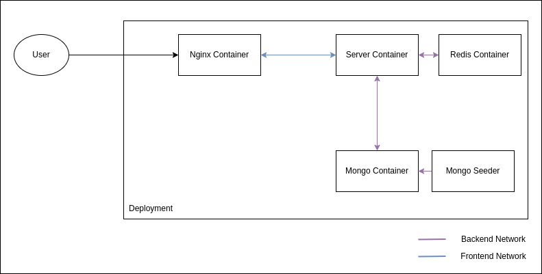

# Ecommerce

## Design

## Setup
1. Clone repo
2. Open repo from terminal
3. Run `docker-compose up`

### Developer Notes

Since the project has to be out of the box without any modifications, `.env` is also commited in the code

- Web part stuff is not implemeted
- `order` APIs are not implemented
- Running tests consecutively will throw error in user creation API since the first record is not deleted
- Use `.env.local` to run the project separately outside outside docker (`cd /server` and run `npm run dev:watch`)
- Run `fuser -k PORT/tcp` in case of **EADDRESINUSE**
- Change `LOG_LEVEL` to `info` before going to production

Cheers!